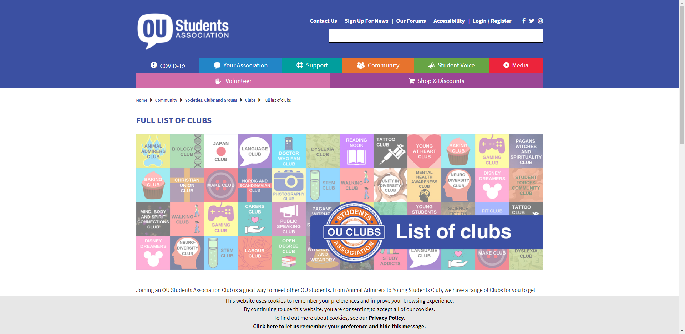

# The Club for You

### Our Goals
The Club for You aims to provide a directory for UH Manoa student clubs, both registered and unregistered. This way, it will be easy for students to see what different clubs are out there and how they can join them.

Each club's entry will have (as many as applicable): 
- a description
- meeting times / locations
- a club website URL
- contact information
- a few photos

&nbsp;

### Landing page
Landing page will provide a basic idea of the project to the user and have a explaination to the users on how to use it.
* Navigation Bar: Home, Clubs
### User home page
User Page will provide all the developed tools that can be accessed by the user in this project to help them find a interested clubs.
* Clubs Information(Description, Meeting time, Location etc.)
* Navigation Bar: Home, Clubs
### Admin home page
* Clubs Information(Description, Meeting time, Location etc.)
* Navigation Bar: Home, Clubs, Edit Club (All Clubs)
### Club admin home page.
* Clubs Information(Description, Meeting time, Location etc.)
* Navigation Bar: Home, Clubs, Edit Club (Their Own Clubs)
### Browse clubs by interest area(s)
* Each clubs has specific interest tag on, then user can find them if they interest on that specific area.


## Mockup Page example


## User Guide (Screen Shot of Each Page Section )

## Community Feedback(Coming Soon)

## Developer Guide
Installation

First, [install Meteor](https://www.meteor.com/install).

Second, go to [https://github.com/the-club-for-you/the-club-for-you](https://github.com/the-club-for-you/the-club-for-you), and click the "Use this template" button. Complete the dialog box to create a new repository that you own that is initialized with this template's files.

Third, go to your newly created repository, and click the "Clone or download" button to download your new GitHub repo to your local file system.  Using [GitHub Desktop](https://desktop.github.com/) is a great choice if you use MacOS or Windows.

Fourth, cd into the app/ directory of your local copy of the repo, and install third party libraries with:

```
$ meteor npm install
```

## Running the system

Once the libraries are installed, you can run the application by invoking the "start" script in the [package.json file](https://github.com/the-club-for-you/the-club-for-you/blob/master/app/package.json):

```
$ meteor npm run start
```

If all goes well, the application will appear at [http://localhost:3000](http://localhost:3000).

## Application Design
The Club For You is build based upon [meteor-application-template-react](https://ics-software-engineering.github.io/meteor-application-template-react/). Please use the videos and documentation at those sites to better acquaint yourself with the basic application design and form processing in The Club For You.


## Development History 
Milestone 1: (Coming soon)
Milestone 2: (Coming soon)
Milestone 3：(Coming soon)

## Contact Us (Coming Soon)

## Team
- Jingzhe Feng
- Joy Okimoto
- Malia Liu
- Trevor Kansaki


